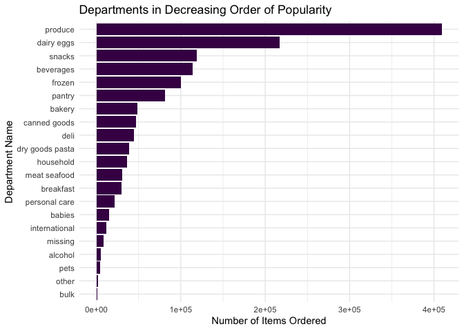
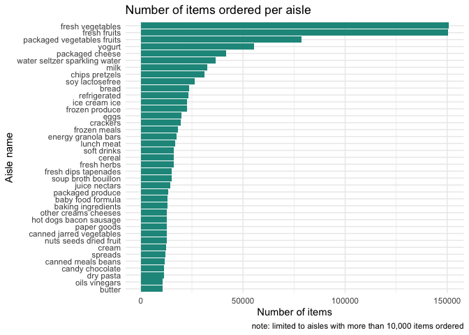
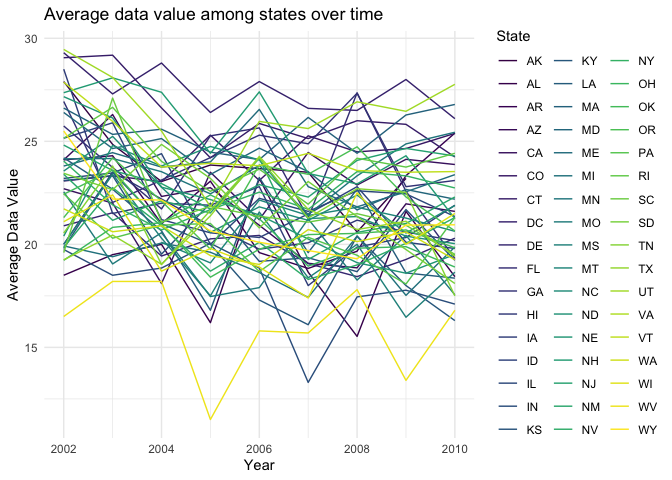
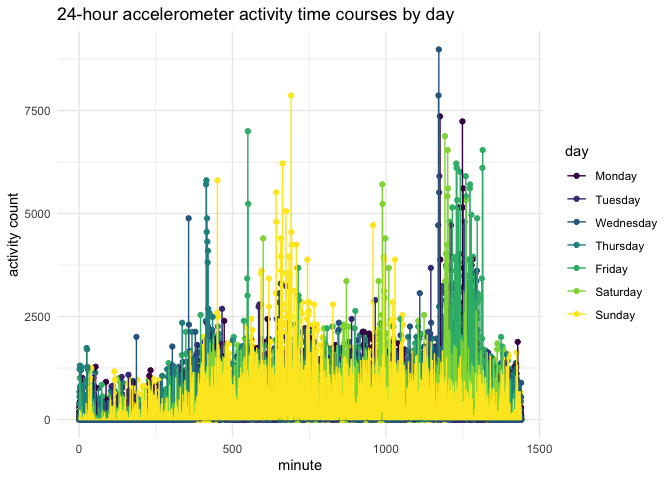

p8105\_hw3\_smm2350
================
Shaina Mackin
2021-10-20

# Homework 3

To begin, I will load libraries and instacart data, and set theme
options.

## Problem 1

### Instacart data

I will write a short description of the dataset, noting the size and
structure of the data, describing key variables, and giving illustrative
examples of observations:

The instacart dataset contains online grocery shopping data from 2017,
with 1384617 observations, or products from orders, and 15 variables,
for a total of 20769255 data points. Key variables include `order_id`,
`product_id`, `user_id`, whether items were `reordered`,
`order_hour_of_day` and `days_since_prior_order` (ranging from 0 to 30)
as well as `product_name` and associated `aisle` and `department`.

Initial exploratory analysis shows `produce` to be the most frequently
ordered-from department, as visualized below:

``` r
instacart %>%
  count(department) %>%
  arrange(desc(n)) %>%
  ggplot(aes(forcats::fct_reorder(department, (n)), n)) +
  geom_col(fill="#440154FF") +
  coord_flip() +
  labs(
    title = "Departments in Decreasing Order of Popularity",
    x = "Department Name",
    y = "Number of Items Ordered")
```

<!-- -->

Further exploratory analysis let’s us investigate the busiest hour of
the day for orders, on average.

``` r
instacart %>%
  ggplot(aes(x = order_hour_of_day)) +
  geom_histogram(binwidth = .5, fill = "#39568CFF") +
  labs(
    title = "Order Volume Over 24-Hour Day",
    x = "Hour of Day",
    y = "Order Count"
  )
```

<!-- -->

Hour 14, or 2pm, has the highest volume of orders placed, on average.

#### Let’s explore how many aisles there are, and which are most ordered from.

``` r
instacart %>%
  group_by(aisle_id, aisle) %>%
  summarize(n_obs = n()) %>%
  arrange(desc(n_obs))
```

    ## `summarise()` has grouped output by 'aisle_id'. You can override using the `.groups` argument.

    ## # A tibble: 134 × 3
    ## # Groups:   aisle_id [134]
    ##    aisle_id aisle                          n_obs
    ##       <int> <chr>                          <int>
    ##  1       83 fresh vegetables              150609
    ##  2       24 fresh fruits                  150473
    ##  3      123 packaged vegetables fruits     78493
    ##  4      120 yogurt                         55240
    ##  5       21 packaged cheese                41699
    ##  6      115 water seltzer sparkling water  36617
    ##  7       84 milk                           32644
    ##  8      107 chips pretzels                 31269
    ##  9       91 soy lactosefree                26240
    ## 10      112 bread                          23635
    ## # … with 124 more rows

There are 134 aisles. The aisles that are most ordered from are
`fresh vegetables` and `fresh fruits`, followed by
`packaged vegetables fruits`.

#### To illustrate this, I will make a plot that shows the number of items ordered in each aisle, limiting to aisles with more than 10000 items ordered.

``` r
instacart %>%
  count(aisle) %>%
  filter(n > 10000) %>%
  ggplot(aes(forcats::fct_reorder(aisle, (n)), n)) +
  geom_col(fill = "#1F968BFF") +
  coord_flip() +
  labs(
    title = "Number of items ordered per aisle",
    x = "Aisle name",
    y = "Number of items",
    caption = "note: limited to aisles with more than 10,000 items ordered"
  )
```

<!-- -->

This again shows that the aisles most ordered from are
`fresh vegetables` and `fresh fruits`, followed by
`packaged vegetables fruits`.

#### I will make a table showing the three most popular items in the `baking ingredients`, `dog food care`, and `packaged vegetables fruits` aisles.

``` r
instacart %>%
  filter(aisle == "baking ingredients" | 
           aisle == "dog food care" | 
           aisle == "packaged vegetables fruits") %>%
 count(aisle, product_name) %>%
  arrange(desc(n)) %>%
  group_by(aisle) %>%
  slice(1:3) %>%
  arrange(desc(n)) %>%
  group_by(aisle) %>%
  knitr::kable(caption = "Top  3  Items Per Aisle")
```

| aisle                      | product\_name                                 |    n |
|:---------------------------|:----------------------------------------------|-----:|
| packaged vegetables fruits | Organic Baby Spinach                          | 9784 |
| packaged vegetables fruits | Organic Raspberries                           | 5546 |
| packaged vegetables fruits | Organic Blueberries                           | 4966 |
| baking ingredients         | Light Brown Sugar                             |  499 |
| baking ingredients         | Pure Baking Soda                              |  387 |
| baking ingredients         | Cane Sugar                                    |  336 |
| dog food care              | Snack Sticks Chicken & Rice Recipe Dog Treats |   30 |
| dog food care              | Organix Chicken & Brown Rice Recipe           |   28 |
| dog food care              | Small Dog Biscuits                            |   26 |

Top 3 Items Per Aisle

We see that `organic baby spinach`, `organic raspberries`, and
`organic blueberries` are the top three ordered items from the
`packaged vegetables fruits` aisle; `light brown sugar`,
`pure baking soda`, and `cane sugar` are the top three ordered items
from the `baking ingredients` aisle; and
`snack sticks chicken & rice recipe dog treats`,
`organix chicken & brown rice recipe`, and `small dog biscuits` are the
top three ordered items from the `dog food care` aisle, respectively.

#### I will make a 2x7 table showing the mean hour of the day at which Pink Lady Apples and Coffee Ice Cream are ordered on each day of the week.

``` r
instacart %>%
  mutate(t_day_number = order_dow +1) %>%
  mutate(day_of_week = wday(t_day_number, label = TRUE)) %>%
  filter(product_name == "Pink Lady Apples" | product_name == "Coffee Ice Cream") %>%
  group_by(product_name, day_of_week) %>%
  summarize(mean_hour = round(mean(order_hour_of_day), digits = 2)) %>%
  pivot_wider(
    names_from = day_of_week,
    values_from = mean_hour
  ) %>%
  knitr::kable(caption = "Mean Hour of Day Ordered")
```

| product\_name    |   Sun |   Mon |   Tue |   Wed |   Thu |   Fri |   Sat |
|:-----------------|------:|------:|------:|------:|------:|------:|------:|
| Coffee Ice Cream | 13.77 | 14.32 | 15.38 | 15.32 | 15.22 | 12.26 | 13.83 |
| Pink Lady Apples | 13.44 | 11.36 | 11.70 | 14.25 | 11.55 | 12.78 | 11.94 |

Mean Hour of Day Ordered

`Coffee Ice Cream` is ordered, on average, later in the day than
`Pink Lady Apples`.

## Problem 2

### BRFSS data

I will clean the data, formatting to use appropriate variable names,
focusing on the `Overall Health` topic, and only including factored
responses ordered from `Excellent` to `Poor`.

``` r
data("brfss_smart2010")

brfss_tidy = brfss_smart2010 %>%
  janitor::clean_names() %>%
   filter(
    topic %in% "Overall Health",
    response %in% "Poor" | response %in% "Fair" | response %in% "Good" | 
      response %in% "Very good" | response %in% "Excellent") %>% 
 mutate(response_ordered = factor(response, ordered = TRUE, 
        levels = c("Poor", "Fair", "Good", "Very good", "Excellent")))
```

#### Let’s determine which states were observed at 7+ locations in 2002 and 2010.

``` r
brfss_2002 = 
  brfss_tidy %>%
  select(year, locationabbr, locationdesc) %>%
  filter(year == 2002) %>%
  distinct() %>%
  group_by(locationabbr) %>%
  filter(n() >= 7) %>%
  select(locationabbr) %>%
  distinct()

brfss_2010 = 
  brfss_tidy %>%
  select(year, locationabbr, locationdesc) %>%
  filter(year == 2010) %>%
  distinct() %>%
  group_by(locationabbr) %>%
  filter(n() >= 7) %>% 
  select(locationabbr) %>%
  distinct() 
```

In 2002, CT, FL, MA, NJ, NC, PA were observed at 7 or more locations. In
2010, CA, CO, FL, MD, MA, NE, NJ, NY, NC, OH, PA, SC, TX, WA were
observed at 7 or more locations.

#### I will construct a dataset that is limited to Excellent responses, and contains, year, state, and a variable that averages the data\_value across locations within a state. I will also make a “spaghetti” plot of this average value over time within a state.

``` r
df_excellent = brfss_tidy %>%
  filter(response %in% "Excellent") %>%
  select(year, locationabbr, data_value) %>%
  unique() %>%
  na.omit() %>%
  group_by(locationabbr, year) %>%
  mutate(
    avg_data_value = mean(data_value)) %>%
  select(year, locationabbr, avg_data_value) %>%
  distinct()

df_excellent %>%
  ggplot(aes(x = year, y = avg_data_value)) +
  geom_line(aes(group = locationabbr, color = locationabbr)) +
  labs(
    title = "Average data value among states over time",
    x = "Year",
    y = "Average Data Value") +
  guides(col=guide_legend("State")) +
  theme(legend.position = "right")
```

<!-- -->

Among `excellent` responses, the lowest average state data value over
the years was `WV` at 11.5 while the highest was `UT` at 29.46.

#### I will make a two-panel plot showing, for the years 2006, and 2010, distribution of data\_value for responses (“Poor” to “Excellent”) among locations in NY State.

``` r
brfss_tidy %>%
  select(year, data_value, locationabbr, locationdesc, response_ordered) %>%
  filter(
    year == 2006 | year == 2010,
    locationabbr == "NY") %>%
  ggplot(aes(x = data_value, fill = response_ordered)) +
  geom_density(aes(fill = response_ordered), alpha = .5) + 
  labs(
    title = "Data value across responses among NY locations",
    x = "Data Value",
    fill = "Response"
  ) +
  theme(
    axis.title.y = element_blank(),
    axis.text.y = element_blank()) +
  facet_grid(. ~ year) +
   guides(col=guide_legend("Location"))
```

<!-- -->

For both `2006` and `2010`, the highest `data_value` among all NY
locations was associated with a `Good` `response`.

## Problem 3

### Accelerometer data

First, I will load and tidy the accelerometer data.

``` r
accel_df = read_csv("accel_data.csv") %>%
  janitor::clean_names() %>%
  mutate(
    day = factor(day, ordered = TRUE,
                 levels = c("Monday", "Tuesday", "Wednesday", "Thursday", 
                            "Friday", "Saturday", "Sunday")),
    week = factor(week, ordered = TRUE,
                  levels = c(1:5)),
    weekend_or_weekday = ifelse(day %in% c("Saturday", "Sunday"), 
                                "weekend", "weekday") %>%
    factor(levels = c("weekday", "weekend"))) %>%
    pivot_longer(
    activity_1:activity_1440,
    names_to = "minute",
    names_prefix = "activity_",
    values_to = "count")
```

The tidied `accel_df` contains 50400 rows (or observations), one for
every `minute` of every `day` from the 5 `week` period of accelerometer
data collection. The dataset’s 6 variables include the following: week,
day\_id, day, weekend\_or\_weekday, minute, count.

#### Daily activity

I will aggregate across minutes to create a total activity variable for
each day, and create a table showing these totals.

``` r
daily_df = accel_df %>%
  group_by(day_id) %>%
  summarize(activity = sum(count)) %>%
  mutate(day_id = paste("day", day_id)) %>%
  pivot_wider(
    names_from = day_id,
    values_from = activity)

knitr::kable(daily_df, caption = "Total Daily Activity")
```

|    day 1 |    day 2 |  day 3 |  day 4 |    day 5 |    day 6 |  day 7 |  day 8 |  day 9 | day 10 | day 11 | day 12 | day 13 | day 14 | day 15 | day 16 | day 17 | day 18 | day 19 | day 20 | day 21 | day 22 | day 23 | day 24 | day 25 | day 26 | day 27 | day 28 | day 29 | day 30 | day 31 | day 32 | day 33 | day 34 | day 35 |
|---------:|---------:|-------:|-------:|---------:|---------:|-------:|-------:|-------:|-------:|-------:|-------:|-------:|-------:|-------:|-------:|-------:|-------:|-------:|-------:|-------:|-------:|-------:|-------:|-------:|-------:|-------:|-------:|-------:|-------:|-------:|-------:|-------:|-------:|-------:|
| 480542.6 | 78828.07 | 376254 | 631105 | 355923.6 | 307094.2 | 340115 | 568839 | 295431 | 607175 | 422018 | 474048 | 423245 | 440962 | 467420 | 685910 | 382928 | 467052 | 371230 | 381507 | 468869 | 154049 | 409450 |   1440 | 260617 | 340291 | 319568 | 434460 | 620860 | 389080 |   1440 | 138421 | 549658 | 367824 | 445366 |

Total Daily Activity

No significant activity trends appear. The maximum daily activity was
4.45366^{5}. The minimum daily activity was 4.45366^{5}.

#### 24-hour plot

I will make a single-panel plot that shows the 24-hour activity time
courses for each day and use color to indicate day of the week.

``` r
accel_plot = accel_df %>%
  mutate(minute = as.numeric(minute))

accel_plot %>%
  group_by(day_id) %>%
  ggplot(aes(x = minute, y = count, color = day)) +
  geom_point() +
  geom_line() +
  labs(
    title = "24-hour accelerometer activity time courses by day",
    x = "minute",
    y = "activity count"
  ) +
   theme(legend.position = "right")
```

<!-- -->

Based on this graph, it appears the highest activity count was on a
`Wednesday`, followed by a `Sunday`.
